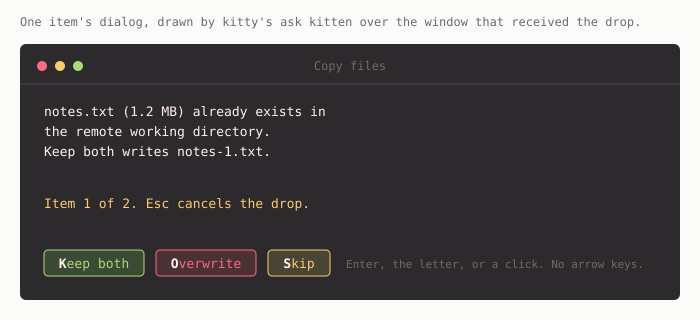
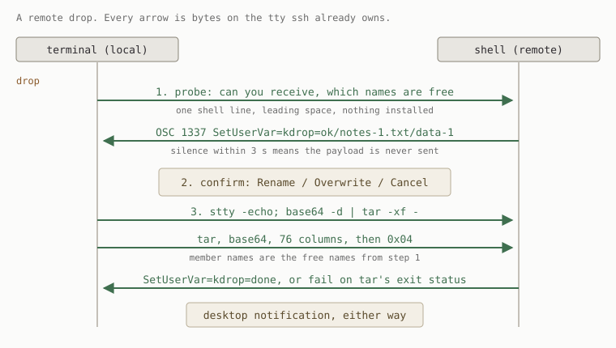

# ttydnd

Drag files onto your terminal and they land in the shell's working directory.
Over ssh they land on the remote, which needs nothing installed.




The files ride the tty that ssh already owns, as a tar stream typed at the prompt.
No agent, no port, no second connection, nothing written to the remote except what you dropped.
Nested ssh, `sudo -i` and serial consoles work for the same reason.

## Requirements

| Where | Needs |
| --- | --- |
| Local | kitty 0.48 or newer with shell integration on, which is kitty's default |
| Remote | a POSIX shell plus `base64`, `tar`, `stty` and `printf` |

Every remote requirement ships in coreutils and in busybox, so a stock Linux, macOS or Alpine host already qualifies.
Verified on `sh`, `bash`, `zsh`, `dash` and busybox `ash`.

## Install

### Home Manager

```nix
{
  inputs.ttydnd.url = "github:bjoern621/ttydnd";

  # in your home-manager configuration
  imports = [ inputs.ttydnd.homeModules.default ];
  programs.ttydnd.enable = true;
}
```

### kitty alone

```sh
git clone https://github.com/bjoern621/ttydnd
cp ttydnd/kitty/drop.py ~/.config/kitty/
printf 'watcher drop.py\n' >> ~/.config/kitty/kitty.conf
```

Watchers attach when a window is created, so open windows keep kitty's own drop behaviour until you make a new one.

## Options

| Option | Default | Effect |
| --- | --- | --- |
| `programs.ttydnd.enable` | `false` | Turns the watcher on |
| `programs.ttydnd.dragOut` | `true` | Binds left press so a drag starting on a hyperlink carries that file out |
| `programs.ttydnd.hyperlinkAlias` | `null` | Name for an `ls --hyperlink=auto` alias, for example `"lsh"` |

## What a drop does

| Situation | Result |
| --- | --- |
| Local shell at a prompt | Confirm, then copy into the reported cwd |
| Shell over ssh | Confirm, then send, then a desktop notification either way |
| A name already exists | The dialog offers Rename or Overwrite, and names the clash |
| Two dropped items share a basename | The second is suffixed, so a drop never loses an item |
| A full-screen program owns the screen | Falls back to kitty's own handling, so `vim` is never typed at |
| The remote does not answer in three seconds | Falls back to pasting the paths |

Renaming counts up from `notes-1.txt` until the name is free, on either end.

## Dragging files out

`dragOut` binds left press to `drag_or_normal_select`.
A drag that starts on a hyperlink carries that file to another window or to a file manager, and text selection is unchanged everywhere else.

Output has to carry the hyperlinks for there to be anything to drag.
`ls --hyperlink=auto` adds them, hence `hyperlinkAlias`, and `kitten hyperlinked_grep` adds them already.

## How it reaches a remote



A probe goes first and answers two questions in one round trip: whether this end can receive at all, and which name is free for each dropped name.
Silence means the payload is never typed, which is what makes it safe to point at an unknown host.

[docs/protocol.md](docs/protocol.md) has the wire format, and the reasons behind the parts that look arbitrary.

## Tests

```sh
nix flake check          # or: python3 tests/run.py
```

The suite drives real shells on real ptys.
Python and the remote shell resolve free names independently, so it runs both and compares them, since a mismatch would make the dialog lie.

## Limits

- Throughput is roughly 1 to 5 MB/s over ssh, so a multi-gigabyte drop is the wrong tool.
- The remote shell records one `stty -echo; base64 -d | tar -xf -` line per drop, unless that shell ignores space-prefixed commands.
- `mosh` carries neither the reply nor the paste reliably.
- tmux on the remote needs `allow-passthrough` for the reply, though the payload itself is fine.
- `Window.on_drop` is kitty internal, so a kitty release can move it.

## Porting

The shell half is terminal agnostic.
A backend needs a drop event, a way to write to the child pty, an event for `OSC 1337 SetUserVar`, and a way to tell that a full-screen program owns the screen.
WezTerm has the first three as `user-dropped-paths` and `user-var-changed`.
Terminals with no scripting hook, such as foot, alacritty and ghostty, cannot host this.

## License

GPL-3.0-only.
The watcher imports kitty's Python modules, and kitty is GPL-3.0.
