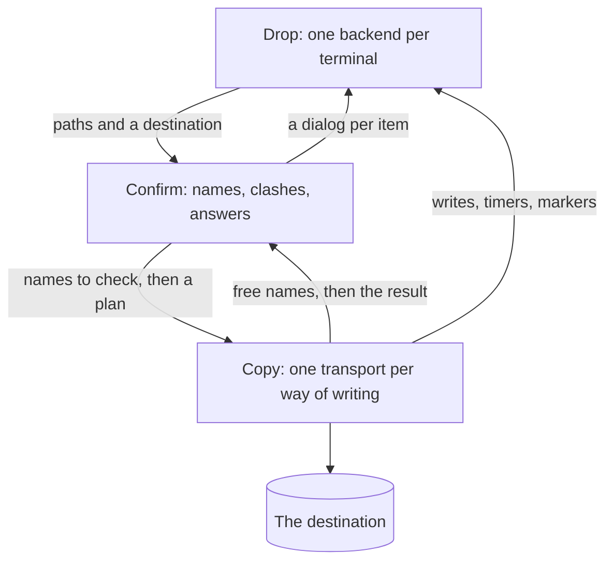

# The three domains

A dropped file crosses three domains on its way into a shell's working directory,
and each one decides something the other two never see.

- **Drop** turns a gesture on a terminal window into local paths and a destination.
- **Confirm** decides what is written and under which name, with the answer coming from the user.
- **Copy** carries the decided plan to the destination.

## Drop

A drop lands on a window,
and the backend for that terminal decides whether the window can take it.
A full-screen program keeps the terminal's own handling, and so does a shell busy running something.
What crosses into the next domain is the paths that were dropped and a destination:
a directory this machine can write, or a shell session the terminal types at.

The backend also offers the port the other two domains reach the terminal through.
Carrying a file back out on a drag belongs to this domain as well,
and is terminal configuration alone.

## Confirm

Each dropped item takes the basename of its path,
and a basename two items share is suffixed until the drop names every item once.
Only the destination can say which of those names are taken.
The domain asks it for a free name per dropped name before anything is written.
A name that comes back changed is a clash,
and that item's dialog offers Keep both, Overwrite or Skip.

Every item gets a dialog, nothing is written before the last answer,
and Esc on any item cancels the drop.
What leaves the domain is a plan:
the source path and the name it takes at the destination, for each item kept.

## Copy

One transport is one way of writing to a destination, and the domain holds a list of them.
Every transport ranks itself against the destination, and the highest rank carries the drop.
A destination no transport serves falls back to the terminal's own handling,
which for a dropped path is a paste.

A transport answers two questions: which names are free at the destination, and whether a plan arrived intact.
Both answers can take a round trip,
so a transport holds the terminal until its answer arrives.
The marker on the window stays until it lets go.

## What crosses between them

The vocabulary is the whole of what one domain knows about the next.

A destination is a directory this machine can write, or a shell session the terminal types at.
A free name is the first name a destination has nothing at, counting up from `name-1`.
A plan is the source path and the name it takes at the destination, per item kept.
The terminal port is what a backend lets the other domains do: write, wait, ask, report, mark.

The free-name rule holds at both ends.
The confirm domain applies it to the dropped names,
and every transport applies it at its destination.
The suite runs both and compares them, since a mismatch would make a dialog lie.

## Replacing one

A domain is replaced by conforming to what crosses its edges, and the other two notice nothing.
A terminal backend is the drop domain for one terminal,
and [terminal-backends.md](terminal-backends.md) states what it owes.
A transport is one implementation of the copy domain,
and [copy-transports.md](copy-transports.md) states what it owes.
The confirm domain names neither a terminal nor a way of writing.
Paths and a destination reach it, and a dialog per item and a plan leave it.
A different set of questions in between is a different implementation of the same edges.
